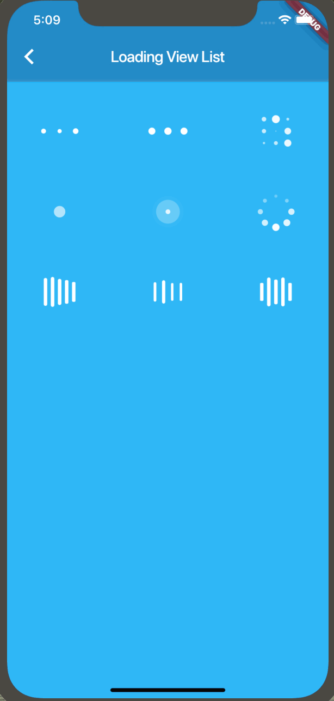

## Loading

A flutter widget of loading progress Indicator. Easy to use, easy to extend



## Installation

Add dependency to pubspec.yaml

```
dependencies:
  ...
  loading: ^1.0.2
```
Run in your terminal

```
flutter packages get
```


## Example

``` Dart
      body: Container(
        color: Colors.lightBlue,
        child: Center(
          child: Loading(indicator: BallPulseIndicator(), size: 100.0, color: Colors.pink),
        ),
      ),
```

## Thanks

[AVLoadingIndicatorView](https://github.com/81813780/AVLoadingIndicatorView)
